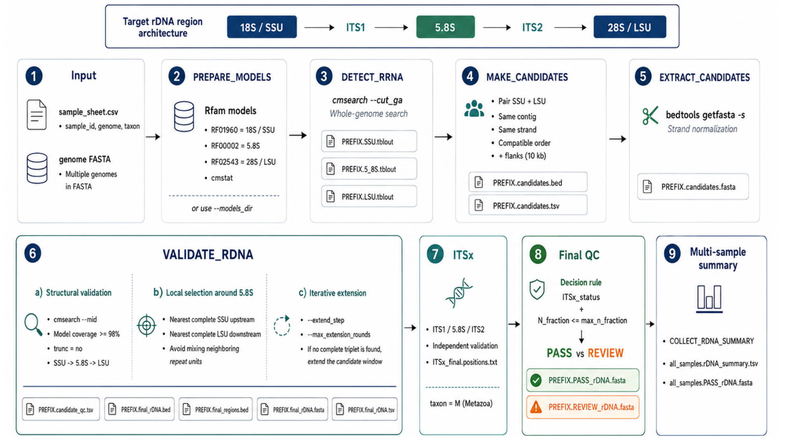

# rDNA_search
### This pipeline is intended to answer the following questions:  

- Where are candidate nuclear rDNA loci located?  
- Does a candidate contain a complete SSU -> 5.8S -> LSU structure?  
- Are ITS1 and ITS2 structurally compatible with an rDNA?  
- Which recovered regions can be classified as high-confidence ```PASS``` sequences?
  


## Requierements
Nextflow >= 23.10.0  
Singularity or Apptainer  

## Usage
### Building the container  
```
chmod +x containers/build_container.sh
./containers/build_container.sh
```
### Local execution
```
nextflow run main.nf \
    -profile singularity \
    --input sample_sheet.csv \
    --outdir results \
    -resume
```

## rDNA models
Three Rfam covariance models are used as conserved anchors.

18S/SSU ---- RF01960 ----  5' external anchor  
5.8S ---- RF00002 ---- central anchor  
28S / LSU ---- RF02543 ---- 3' external anchor  


The models are downloaded automatically unless a local model directory is supplied with:

```
--models_dir /path/to/rfam_models
```

## Input genomes
Input genomes are provided through a sample sheet in cvs format.  

Example sample_sheet.csv  
sample_id, genome, taxon  
Specie,/PATH_TO/genome_accession_specie_genomic.fna,M  
M = Metazoa (ITSx)  

## Output
Example:    
results/  
├── 00_models/  
│   └── rfam_models/  
│  
├── Specie/  
│   │  
│   ├── 01_detection/  
│   │   ├── Specie.SSU.tblout  
│   │   ├── Specie.SSU.out  
│   │   ├── Specie.5_8S.tblout  
│   │   ├── Specie.5_8S.out  
│   │   ├── Specie.LSU.tblout  
│   │   └── Specie.LSU.out  
│   │  
│   ├── 02_candidates/  
│   │   ├── Specie.candidates.bed  
│   │   ├── Specie.candidates.tsv  
│   │   └── Specie.candidates.fasta  
│   │  
│   └── 03_validated/  
│       ├── Specie.candidate_qc.tsv  
│       ├── Specie.final_rDNA.tsv  
│       ├── Specie.final_rDNA.bed  
│       ├── Specie.final_regions.bed  
│       ├── Specie.final_rDNA.fasta  
│       ├── Specie.PASS_rDNA.fasta  
│       ├── Specie.REVIEW_rDNA.fasta  
│       ├── Specie.ITSx_final.positions.txt  
│       └── Specie.ITSx_final.*.fasta  
│  
├── summary/  
│   ├── all_samples.rDNA_summary.tsv  
│   └── all_samples.PASS_rDNA.fasta  
│  
└── pipeline_info/  
    ├── execution_report.html  
    ├── execution_trace.txt  
    └── execution_timeline.html  

## Software citations
If you use this pipeline, please cite:  
**Nextflow** doi: 10.1038/nbt.3820. Nextflow documentation: https://www.nextflow.io/docs/latest/.        
**Singularity** doi: 10.1371/journal.pone.0177459.  
**Rfam** doi: 10.1093/nar/gkae1023.  
**Infernal** doi: 10.1093/bioinformatics/btt509.  
**SAMtools** doi: 10.1093/bioinformatics/btp352.  
**BEDTools** doi: 10.1093/bioinformatics/btq033.  
**ITSx** doi: 10.1111/2041-210X.12073.  
**SeqKit** doi: 10.1371/journal.pone.0163962.  
Rfam RF01960. SSU_rRNA_eukarya: eukaryotic small-subunit ribosomal RNA family. https://rfam.org/family/RF01960.  
Rfam RF00002. 5_8S_rRNA: 5.8S ribosomal RNA family. https://rfam.org/family/RF00002.  
Rfam RF02543. LSU_rRNA_eukarya: eukaryotic large-subunit ribosomal RNA family. https://rfam.org/family/RF02543.  

### Generative AI disclosure
OpenAI ChatGPT (GPT-5.6 Sol) was used to assist with code development, workflow configuration, documentation, and troubleshooting. The human maintainer reviewed and revised all AI-assisted outputs and is responsible for the scientific decisions, validation, interpretation, and any remaining errors.

#### Disclaimer: This workflow is provided “as is,” without warranties or guarantees of any kind. Users are responsible for reviewing, validating, and testing the workflow before using it for research or any other purpose.
